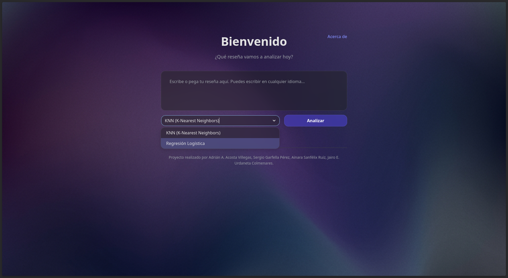
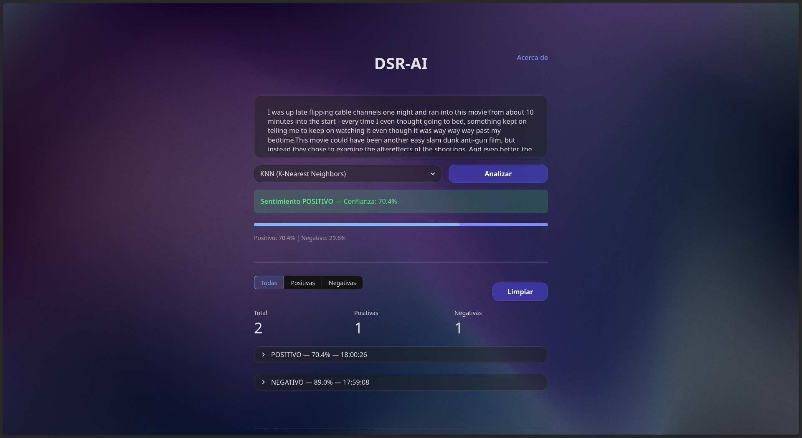
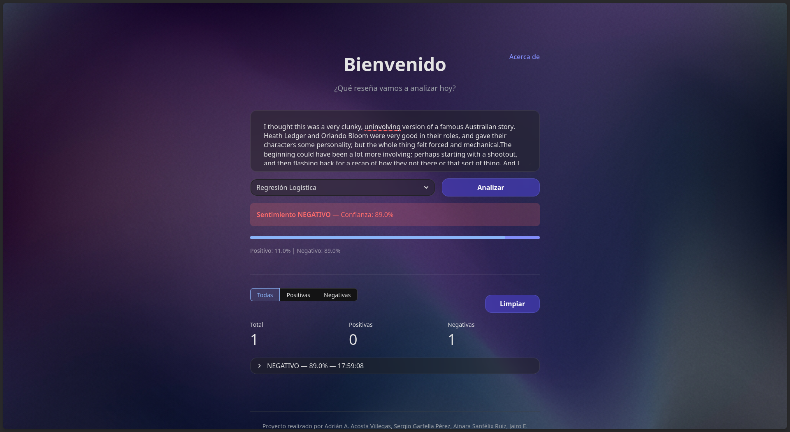

<div align="center">

# Sistema de Detección de Sentimiento en Reseñas de Usuarios (DSR-AI)

<br/>

> **Clasifica reseñas de películas como positivas o negativas** con modelos de ML entrenados sobre 10 000 reseñas reales de IMDb, con soporte multilingüe y una interfaz web interactiva.

</div>

---

## Instalación y uso

### 1. Clonar el repositorio

```bash
git clone https://github.com/sergiogarfella/dsr-ai.git
cd dsr-ai
```

### 2. Instalar dependencias de la app web

```bash
pip install -r web-app/requirements.txt
```

### 3. Lanzar la interfaz Streamlit

```bash
cd web-app
streamlit run app.py
```

> La app cargará los modelos automáticamente desde el paquete `dsr/` al arrancar.

---

## Capturas de pantalla

**Pantalla principal — Selector de modelos**



**Resultados**





---

## Características principales

| Capacidad | Detalle |
|---|---|
| **Multilingüe** | Traducción automática al inglés (Google Translate) antes del análisis |
| **Dos modelos** | KNN (K-Nearest Neighbors) y Regresión Logística seleccionables en la UI |
| **Confianza** | Muestra el porcentaje de confianza y la probabilidad de cada clase |
| **Historial** | Registro filtrable de los análisis realizados durante la sesión |
| **Interfaz moderna** | Web app Streamlit con tema oscuro y CSS personalizado |

---

## Arquitectura del sistema

El sistema sigue un pipeline de cuatro etapas:

1. **Traducción** — El texto de entrada (cualquier idioma) se traduce automáticamente al inglés mediante Google Translate.
2. **Limpieza** — `CleanText` elimina HTML, URLs, emojis y puntuación; aplica tokenización, eliminación de stopwords y lematización POS con NLTK.
3. **Vectorización** — El texto limpio se convierte en un vector de 384 dimensiones mediante un modelo Doc2Vec entrenado (Gensim).
4. **Clasificación** — El vector se pasa al modelo elegido (KNN o Regresión Logística), que devuelve la etiqueta y la probabilidad de cada clase.

---

## Estructura del repositorio

- **`dsr/`** — Paquete Python principal. Contiene la clase `Dsr` (API de predicción), el pipeline de limpieza de texto y los modelos entrenados (Doc2Vec, KNN, Regresión Logística).
- **`web-app/`** — Interfaz web construida con Streamlit. Incluye la página principal, estilos CSS y las dependencias propias de la app.
- **`src/`** — Scripts de entrenamiento: preprocesamiento del corpus, vectorización con Doc2Vec y entrenamiento/evaluación de los clasificadores.
- **`datasets/`** — Corpus utilizados: Large Movie Review Dataset (IMDb), Review Polarity y Stanford Sentiment Treebank.
- **`docs/`** — Notebooks de análisis exploratorio y documentación del proyecto.

---

## Pipeline de entrenamiento

El pipeline completo se encuentra en `src/` y sigue estos pasos:

1. `limpieza_datos.py` — Carga el dataset unificado, balancea las clases (5 000 pos + 5 000 neg para train; 2 500 + 2 500 para test) y guarda los documentos tokenizados en `data/processed/`.
2. `vectorizacion_train_test.py` — Entrena el modelo Doc2Vec sobre el corpus de entrenamiento y vectoriza ambos conjuntos, guardando `X_train.pkl` y `X_test.pkl`.
3. `knn_training_and_metrics.py` / `lr_training_metrics.py` — Entrenan los clasificadores sobre los vectores y serializan los modelos en `dsr/`.

### Configuración de modelos

| Modelo | Parámetro | Valor |
|---|---|---|
| **Doc2Vec** | `vector_size` | 384 |
| | `window` | 5 |
| | `epochs` | 150 |
| | `dm` | 1 (Distributed Memory) |
| | `min_count` | 2 |
| **KNN** | `n_neighbors` | 71 |
| | `metric` | cosine |
| | `weights` | distance |
| | `algorithm` | brute |
| **Regresión Logística** | `penalty` | l2 |
| | `C` | 0.01 |
| | `solver` | saga |
| | `max_iter` | 1000 |

---

## Equipo

<div align="center">

| Nombre | GitHub |
|---|---|
| **Adrián A. Acosta Villegas** | [@ghosT26785](https://github.com/ghosT26785) |
| **Sergio Garfella Pérez** | [@sergiogarfella](https://github.com/sergiogarfella) |
| **Ainara Sanfélix Ruiz** | [@ainarasanru](https://github.com/ainarasanru) |
| **Jairo E. Urdaneta Colmenares** | [@jairo-pixel](https://github.com/jairo-pixel) |

</div>

---

<div align="center">

Proyecto desarrollado para la asignatura **Proyecto I : Introducción a la IA**

**Universitat Politècnica de València (UPV)**

<br/>

**Datasets utilizados**

_[Large Movie Review Dataset](http://ai.stanford.edu/~amaas/data/sentiment/) — Maas et al., ACL 2011_

_[Movie Review Polarity Dataset v2.0](https://www.cs.cornell.edu/people/pabo/movie-review-data/) — Pang & Lee, ACL 2004_

_[Stanford Sentiment Treebank](https://nlp.stanford.edu/sentiment/) — Socher et al., EMNLP 2013_

</div>
